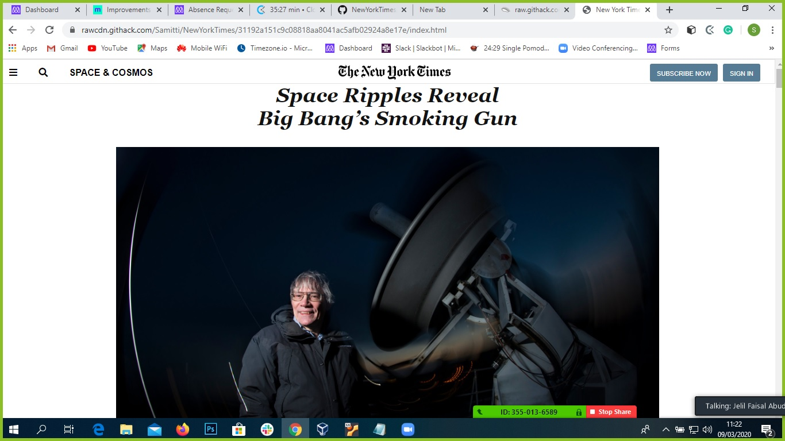
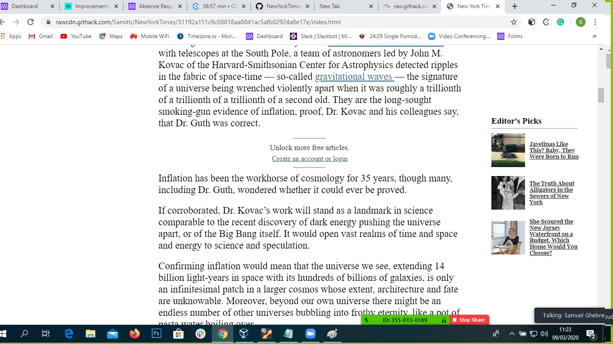
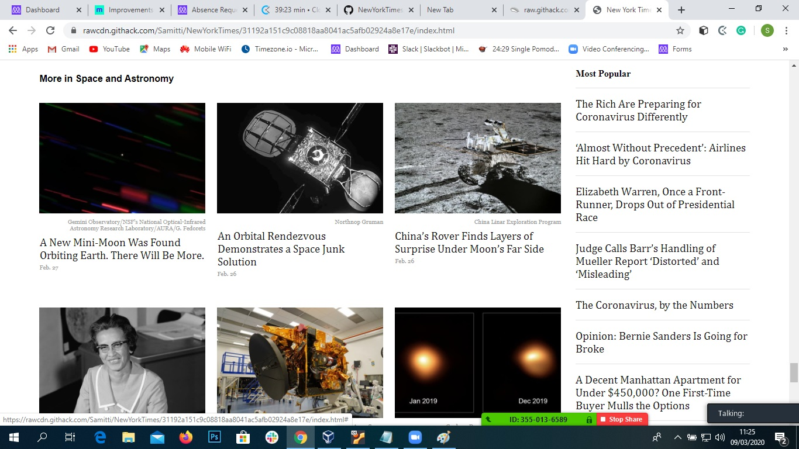

# NewYorkTimes Clone Project
An Example Repo for microverse Projects path as a mockup of New-York Times article page.

Screenshot of Page

 

 

## Built With

- Html,
- Css
- Grid Module
- Flexbox
- Linter validator

[Live Demo Link](https://raw.githack.com/Samitti/NewYorkTimes/homepage/index.html)

## About
An Example Repo for microverse Projects path as a mockup of [New-York times page](https://www.nytimes.com/2014/03/18/science/space/detection-of-waves-in-space-buttresses-landmark-theory-of-big-bang.html?_r=0). 
It contains an exact copy of the layout, and similar functionality and the same user experience.

## Authors

👤 **Jelil Faisal Abudu**

- Github: [@githubhandle](https://github.com/JelilFaisalAbudu)
- Twitter: [@twitterhandle](https://twitter.com/jelilabudu)
- Linkedin: [linkedin](https://www.linkedin.com/in/jelil-faisal-abudu-3b7a2182/)

👤 **Samuel Teweldebrhan Ghebremeskel**

- Github: [@githubhandle](https://github.com/Samitti)
- Twitter: [@twitterhandle](https://twitter.com/Samuel63734232)
- Linkedin: [linkedin](https://www.linkedin.com/in/samuel-ghebremeskel-29685811a/)

## 🤝 Contributing

Contributions, issues and feature requests are welcome!

Feel free to check the [issues page](       ).

## Show your support

Give a ⭐️ if you like this project!

